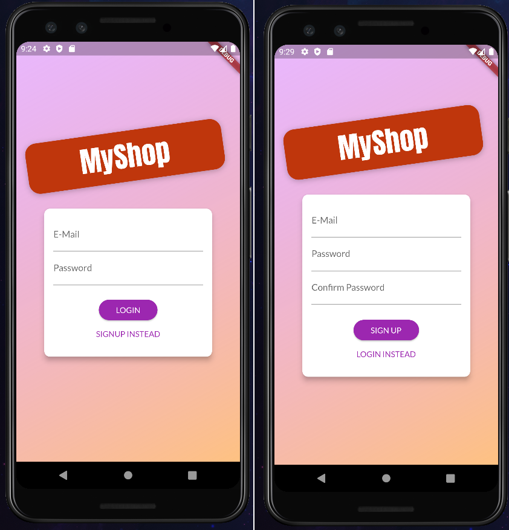
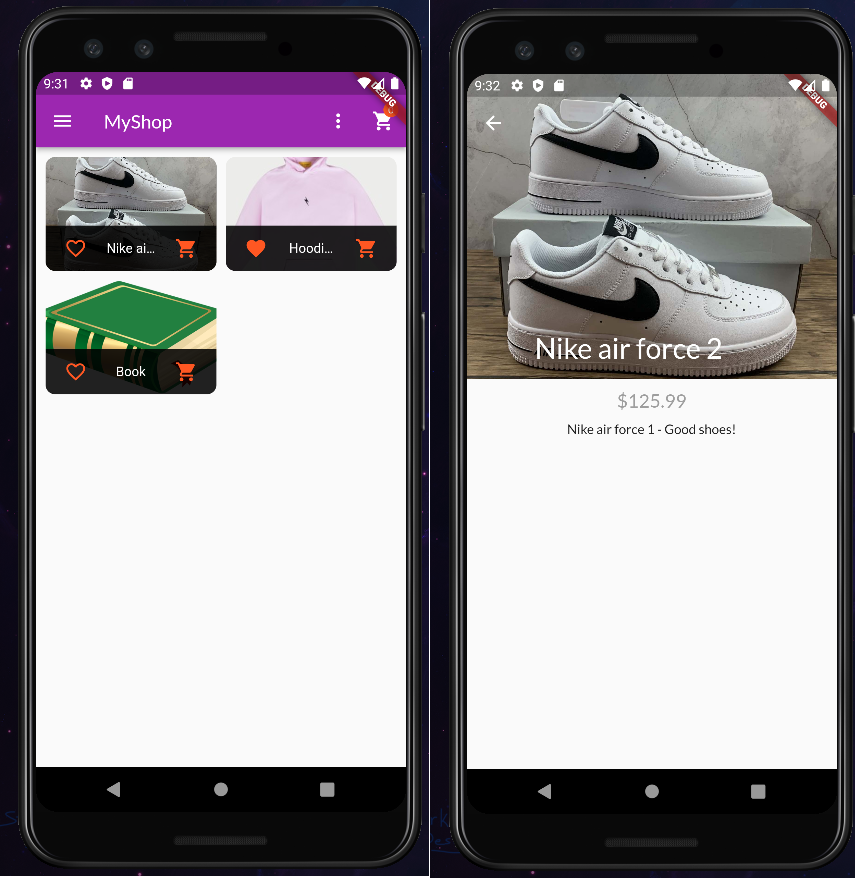
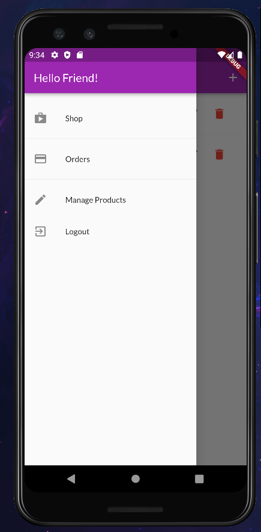
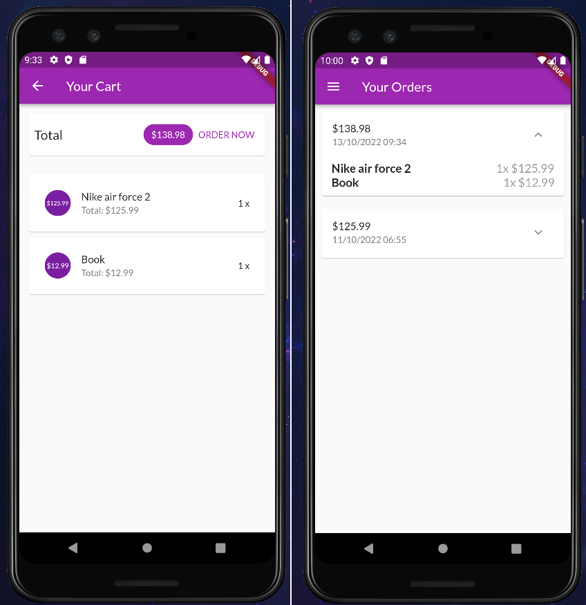
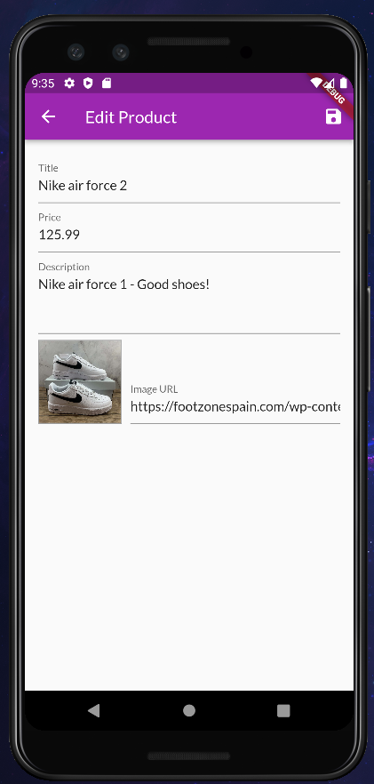

# Meals App

An shop application with products that we can add, edit (only that we create), order, filter, add to favorites.

Technologies used to develop app:
- Flutter
- Firebase

I used JWT for authorization.

## Login / Sign up

## Product Overview and Detail

## App Drawer

## Orders

## Edit product

